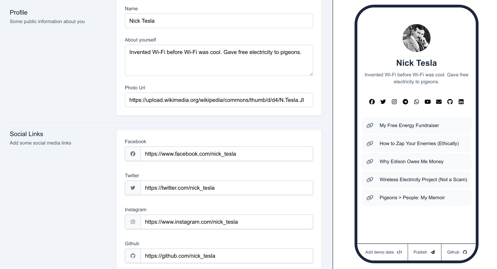

# Bio-in-Link

Bio-in-Link is a lightweight, database-free **link-in-bio** tool where all data is stored directly in the URL. Users can create and share a personalized bio page with social links and custom buttons without requiring backend storage.



## ✨ Features

- No database required – all user data is encoded in the URL.
- Customizable profile with a name, bio, image, and links.
- Social media icons for quick access.
- One-click **Publish** to generate a sharable URL.
- Mobile-friendly design as well.

## 🚀 Demo

### **[Try Bio-in-Link](https://bio-in-link.netlify.app/)**

## 📌 How It Works

1. Fill out your profile details, social links, and custom buttons.
2. Click **Publish** to generate a unique shareable URL.
3. Anyone visiting the link will see your bio page with the provided details.

## 🛠️ Installation

1. Clone the repository:

    ```bash
    git clone https://github.com/your-username/bio-in-link.git
    cd bio-in-link
2. Install dependencies:
    ```npm install```

3. Run the development server:
    ```npm run dev```
    
4.Open http://localhost:3000 in your browser.

## TODO/WIP
- [ ] Add choosable color themes
- [ ] Write unit and e2e tests
